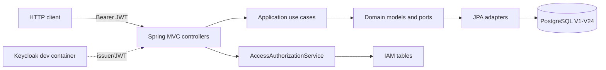
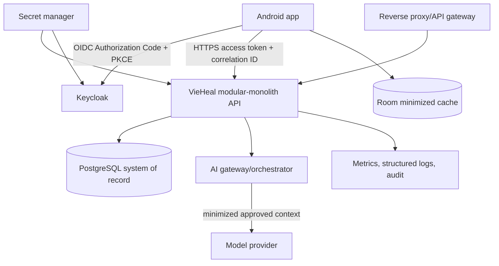

# Architecture

## AS-IS

**[IMPLEMENTED]** The repository is a single Gradle backend project using Kotlin 2.3.21, Java 21, Spring Boot 4.1.1, Spring MVC, Spring Security resource server, JPA, Flyway, PostgreSQL, and Testcontainers. Code is organized as a modular monolith: API DTO/controller → application use case → domain/repository port → JPA adapter. Keycloak and two PostgreSQL containers are described for local development.

There is no Android build, AI runtime, web UI, message broker, reverse proxy, CI workflow, or production deployment in the inspected tree.

## Target production architecture

The Android app is a first-class client, not a second source of truth. The backend owns authorization, tenant boundaries, workflow transitions, AI provider access and persistence. The AI gateway is a backend module initially; extract it only if scaling, regulatory separation or operational ownership justifies the cost.

## Quality attributes and decisions

Tenant identifiers appear in composite database constraints and repository queries; API authorization still must verify organization/facility scope for every operation. Availability favors a stateless API and controlled retries. Confidentiality favors minimum local data, TLS, token protection and redacted observability. Maintainability favors module boundaries and explicit DTO/domain/UI mapping. See ADRs for decisions and open questions.
