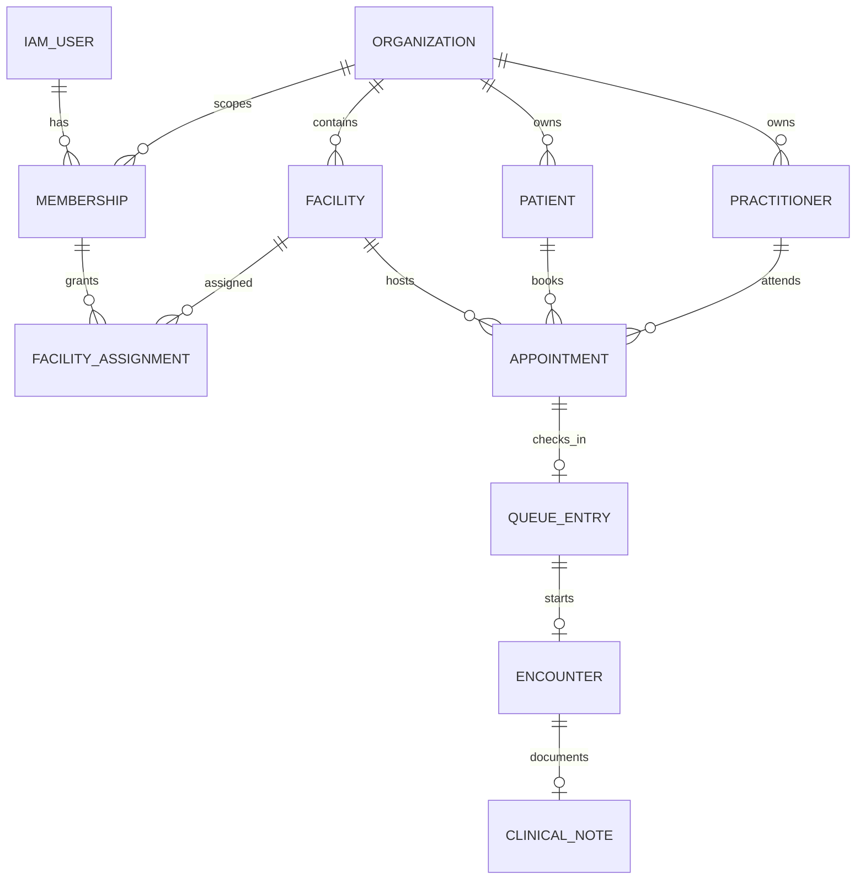
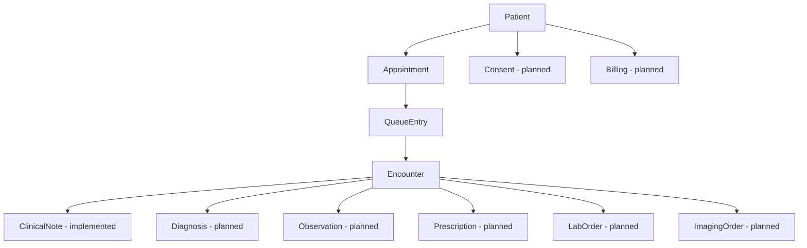

# Domain model

## Implemented model

**[IMPLEMENTED]** Appointment states are `SCHEDULED`, `CANCELLED`, `COMPLETED`, `NO_SHOW`. Queue states are `WAITING`, `CALLED`, `SERVING`, `COMPLETED`, `CANCELLED`. Encounter states are `IN_PROGRESS`, `COMPLETED`, `CANCELLED`.

The encounter invariant is exact: queue entry must be `SERVING` and appointment must remain `SCHEDULED`; patient and practitioner are derived on the server; database constraints allow at most one encounter per appointment and queue entry. Completing an encounter does **not** mutate appointment or queue. The operational workflow therefore requires separate authorized completion actions.

## Target clinical extension

Each future aggregate gets its own lifecycle, permission codes, tenant-safe constraints, audit semantics, and API contract. Narrative AI output is never itself a diagnosis or signed record. Consent and audit schemas created by V1 are empty namespaces, not implemented features.
