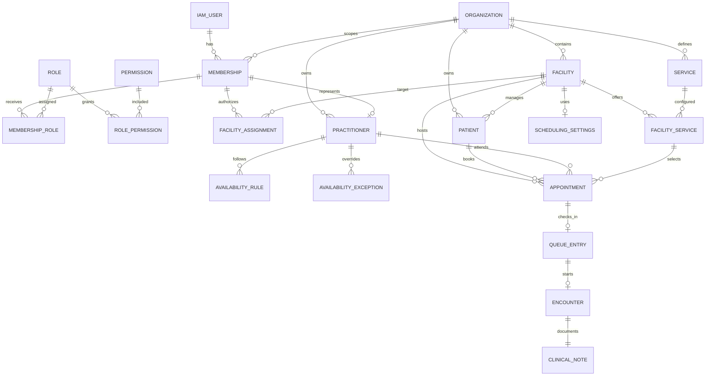

# Database architecture and migration registry

Status: **[IMPLEMENTED]** PostgreSQL is the system of record. JPA maps persistence; Hibernate is configured with `ddl-auto: validate`; Flyway owns schema creation and evolution. V1–V24 are committed and immutable. The next schema change must be `V25__...sql`; never edit a released migration.

## Migration registry

| Version | Filename | Module / purpose | Schemas affected | Tables affected | Permissions affected | Important constraints | Immutable |
|---|---|---|---|---|---|---|---|
| V1 | `V1__create_foundation_schemas.sql` | foundation namespaces | organization, iam, patient, practitioner, consent, audit | none | none | none | yes |
| V2 | `V2__create_organization_tables.sql` | organizations/facilities | organization | organizations, facilities | none | PK UUID; unique organization code; unique facility code per org; status checks; facility→organization FK | yes |
| V3 | `V3__create_iam_tables.sql` | IAM/RBAC | iam | users, roles, permissions, role_permissions, organization_memberships, membership_roles, facility_assignments | model tables | unique external identity/email; one membership per user/org; one assignment per membership/facility; status/scope checks | yes |
| V4 | `V4__seed_iam_roles_permissions.sql` | stable roles/base grants | iam | roles, permissions, role_permissions | organization/facility/IAM permissions; ORGANIZATION_ADMIN mappings | stable role/permission UUIDs; insert seed | yes |
| V5 | `V5__grant_doctor_base_permissions.sql` | doctor base access | iam | role_permissions | DOCTOR gets organization.read, facility.read | conflict-safe insert | yes |
| V6 | `V6__add_patient_permissions.sql` | patient authorization | iam | permissions, role_permissions | patient.read/create/update and role mappings | conflict-safe seed | yes |
| V7 | `V7__create_patient_table.sql` | patient persistence | patient; organization altered | patients; facilities altered | none | tenant-safe facility composite FK; org patient-code unique; sex/status/country/nonblank checks; actor FKs | yes |
| V8 | `V8__add_practitioner_permissions.sql` | practitioner authorization | iam | permissions, role_permissions | practitioner.read/create/update and role mappings | conflict-safe seed | yes |
| V9 | `V9__create_practitioner_table.sql` | practitioner persistence | practitioner; iam altered | practitioners; memberships altered | none | tenant-safe membership composite FK; org code/membership uniqueness; type/status/nonblank checks; actor FKs | yes |
| V10 | `V10__create_service_catalog_schema.sql` | catalog namespace | service_catalog | none | none | none | yes |
| V11 | `V11__add_service_catalog_permissions.sql` | catalog authorization | iam | permissions, role_permissions | service.read/create/update mappings | conflict-safe seed | yes |
| V12 | `V12__create_service_catalog_tables.sql` | services/pricing | service_catalog | services, facility_services | none | tenant-safe facility/service FKs; org service-code and facility-service unique; duration/price/currency/status checks | yes |
| V13 | `V13__create_scheduling_schema.sql` | scheduling namespace | scheduling | none | none | none | yes |
| V14 | `V14__add_scheduling_permissions.sql` | scheduling authorization | iam | permissions, role_permissions | schedule.read/create/update mappings | conflict-safe seed | yes |
| V15 | `V15__create_scheduling_tables.sql` | settings, recurring availability, exceptions | scheduling; practitioner altered | facility_scheduling_settings, practitioner_availability_rules, practitioner_availability_exceptions; practitioners altered | none | one settings row/facility; composite tenant FKs; day/time/date/status checks; lookup indexes | yes |
| V16 | `V16__create_appointment_schema.sql` | appointment namespace | appointment | none | none | none | yes |
| V17 | `V17__add_appointment_permissions.sql` | appointment authorization | iam | permissions, role_permissions | appointment.read/create/update mappings | conflict-safe seed | yes |
| V18 | `V18__create_appointments_table.sql` | bookings and collision prevention | appointment; patient/service tables altered; extension | appointments; supporting unique keys | none | composite tenant FKs; time/status/reason checks; GiST exclusion for patient/practitioner overlaps; org/id unique | yes |
| V19 | `V19__create_reception_schema.sql` | reception namespace | reception | none | none | none | yes |
| V20 | `V20__add_queue_permissions.sql` | queue authorization | iam | permissions, role_permissions | queue.read/create/update mappings | conflict-safe seed | yes |
| V21 | `V21__create_queue_entries_table.sql` | check-in and queue lifecycle | reception; appointment altered | queue_entries; appointments supporting unique key | none | strong appointment/patient/practitioner FK; one queue per appointment; lifecycle/timestamp/status checks | yes |
| V22 | `V22__create_encounter_schema.sql` | encounter namespace | encounter | none | none | none | yes |
| V23 | `V23__add_encounter_permissions.sql` | encounter/note authorization | iam | permissions, role_permissions | encounter.read/create/update, clinical_note.read/update | exact clinical role mappings | yes |
| V24 | `V24__create_encounter_tables.sql` | encounter and narrative note | encounter; reception altered | encounters, clinical_notes; queue supporting unique key | none | strong appointment/queue composite FKs; one encounter per appointment/queue; one note/encounter; lifecycle/content checks | yes |

## Schema catalog

| Schema | Status | Ownership |
|---|---|---|
| `organization` | [IMPLEMENTED] | organizations and facilities |
| `iam` | [IMPLEMENTED] | users, memberships, roles, permissions and facility assignments |
| `patient` | [IMPLEMENTED] | patient profile and managing facility |
| `practitioner` | [IMPLEMENTED] | organization practitioner linked to membership |
| `service_catalog` | [IMPLEMENTED] | medical services and facility-specific offering/price |
| `scheduling` | [IMPLEMENTED] | facility zone, availability rules and exceptions |
| `appointment` | [IMPLEMENTED] | booking lifecycle and overlap prevention |
| `reception` | [IMPLEMENTED] | check-in/queue lifecycle |
| `encounter` | [IMPLEMENTED] | care session and one core narrative note |
| `consent` | **[PLANNED]** | schema exists; no tables or behavior |
| `audit` | **[PLANNED]** | schema exists; no tables or behavior |

## Table and constraint catalog

All tables use UUID primary keys except many-to-many tables whose composite foreign-key columns form the primary key.

| Table | Primary/cardinality rules | Important foreign keys and tenant protection | Checks and indexes |
|---|---|---|---|
| `organization.organizations` | PK id; unique code | none | ACTIVE/INACTIVE/SUSPENDED check |
| `organization.facilities` | PK id; unique `(organization_id,code)`; supporting unique `(organization_id,id)` | organization FK | status check; organization index |
| `iam.users` | PK id; unique `(identity_provider,external_subject)` and email | none | status check; subject index |
| `iam.roles` | PK id; unique code | none | scope SYSTEM/ORGANIZATION |
| `iam.permissions` | PK id; unique code | none | permission lookup by unique code |
| `iam.role_permissions` | composite PK `(role_id,permission_id)` | role and permission FKs | prevents duplicate grant |
| `iam.organization_memberships` | PK id; unique user/org; supporting unique org/id | user and organization FKs | status check; user/org indexes |
| `iam.membership_roles` | composite PK membership/role | membership and role FKs | prevents duplicate assignment |
| `iam.facility_assignments` | PK id; unique membership/facility | membership and facility FKs | status check; membership/facility indexes |
| `patient.patients` | PK id; unique `(organization_id,patient_code)`; supporting org/id | org FK; composite `(org,managing_facility)`→facility; actor user FKs | nonblank code/name; sex/status/country checks; org/facility/status/phone indexes |
| `practitioner.practitioners` | PK id; unique org/code and org/membership; supporting org/id | org FK; composite `(org,membership)`→membership; actor FKs | nonblank/type/status checks; org/member/type/license indexes |
| `service_catalog.services` | PK id; unique org/code; supporting org/id | organization and actor FKs | duration/status/nonblank checks; org/status/category indexes |
| `service_catalog.facility_services` | PK id; unique service/facility; supporting `(org,facility,id)` | composite org/facility and org/service; actor FKs | positive duration, nonnegative price, 3-letter currency, status; booking lookup index |
| `scheduling.facility_scheduling_settings` | PK id; one row per org/facility | composite org/facility; actor FKs | nonblank time zone; org/facility indexes |
| `scheduling.practitioner_availability_rules` | PK id | composite org/facility and org/practitioner; actor FKs | day 1–7, time/date ordering, status; scope/effective lookup indexes |
| `scheduling.practitioner_availability_exceptions` | PK id | composite org/facility and org/practitioner; actor FKs | type/time/reason/status checks; scope/time indexes |
| `appointment.appointments` | PK id; supporting org/id and strong queue-reference unique key | composite org/facility, org/patient, org/practitioner and org/facility/service; actor FKs | end>start; status/reason/cancellation-state checks; GiST exclusions prevent overlapping SCHEDULED patient or practitioner appointments; scope/time/status indexes |
| `reception.queue_entries` | PK id; unique `(org,appointment)`; supporting org/id and encounter-reference key | strong composite appointment link includes org, facility, appointment, patient, practitioner; actor FKs | status, note, lifecycle timestamp presence/order; facility/status/order and patient/practitioner indexes |
| `encounter.encounters` | PK id; unique `(org,appointment)` and `(org,queue_entry)`; supporting org/id and org/facility/id | strong composite links to appointment and queue carry patient/practitioner; actor FKs | status, terminal timestamp/cancellation consistency, terminal time≥start; operational indexes |
| `encounter.clinical_notes` | PK id; unique `(org,encounter)` | composite `(org,facility,encounter)`; actor FKs | nonblank nullable sections; 20k limits for SOAP bodies; org/encounter/facility indexes |

`btree_gist` is created by V18 so UUID equality can participate in GiST appointment exclusion constraints. No exclusion constraint exists for recurring scheduling rules; application logic must handle rule semantics.

## Major ERD

## Invariant enforcement matrix

| Invariant | Enforcement | Evidence |
|---|---|---|
| facility belongs to organization | **DATABASE ENFORCED** plus application lookups | composite FKs from V7 onward |
| patient/practitioner/service references share tenant | **DATABASE ENFORCED** and application validation | composite FKs; create/update use cases |
| unique codes within scope | **BOTH** | unique constraints plus duplicate checks |
| appointment end follows start | **BOTH** | V18 check and domain validation |
| no overlapping SCHEDULED appointment for patient/practitioner | **BOTH** | V18 GiST exclusion plus scheduling use-case checks |
| one queue entry per appointment | **DATABASE ENFORCED** and create guard | V21 unique constraint/use case |
| queue copied patient/practitioner match appointment | **DATABASE ENFORCED** | strong composite FK in V21 |
| queue lifecycle timestamp consistency | **BOTH** | V21 checks and domain transitions |
| QueueEntry must be `SERVING` before Encounter starts | **APPLICATION ENFORCED** | `StartEncounterUseCase`; not a DB check |
| Appointment must be `SCHEDULED` before Encounter starts | **APPLICATION ENFORCED** | `StartEncounterUseCase`; not a DB check |
| encounter patient/practitioner are server-derived and match queue/appointment | **BOTH** | use case derivation plus V24 composite FKs |
| one encounter per appointment and queue entry | **DATABASE ENFORCED** plus duplicate handling | V24 unique constraints/use case |
| encounter terminal timestamps match status | **BOTH** | V24 checks and domain model |
| terminal encounter note is immutable | **APPLICATION ENFORCED** | `UpdateClinicalNoteUseCase`; database has no immutable-row trigger |
| one clinical note per encounter | **DATABASE ENFORCED** | V24 unique `(organization_id,encounter_id)` |
| completing encounter completes queue/appointment | **NOT AN INVARIANT** | no cascade; separate use cases are required |
| caller permission and membership scope | **APPLICATION ENFORCED** | security/access service; database has no row-level security |

## Migration and operations policy

Validate migrations in CI against empty and upgraded PostgreSQL. Use expand/migrate/contract for backward-compatible changes. Production deploy order is backup/readiness check, forward migration, compatible application rollout and verification; routine rollback is application rollback only while schema remains compatible. A corrective forward migration is preferred to editing or undoing V1–V24. RPO, RTO, backup retention, encryption and restore frequency are **[REQUIRES POLICY DECISION]**.

## Related documents

- [Domain model](03-DOMAIN-MODEL.md)
- [Architecture](02-ARCHITECTURE.md)
- [API contract](04-API-SPEC.md)
- [Authorization](07-AUTHORIZATION.md)
- [Mobile data cache](mobile/MOBILE-DATA.md)
