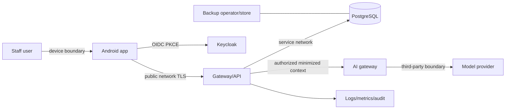

# Security architecture and threat model

Security status is mixed: bearer-token authentication, permission checks and tenant-safe constraints are **[IMPLEMENTED]**; mobile, AI, audit, production identity, TLS, secret management and operational controls are **[TARGET PRODUCTION DESIGN]**.

## Current controls and known debt

Spring Security is stateless, disables CSRF for the bearer-token API, validates JWTs with the configured Keycloak issuer and requires authentication except health and organization creation. Controllers invoke `AccessAuthorizationService`; database composite keys reject several cross-tenant reference combinations. Test suites exercise authentication, permission and tenant scenarios.

**P0 SECURITY DEBT BEFORE PRODUCTION:** `POST /api/v1/organizations` is still `permitAll`. Risk: any network client can create tenant records, consume identifiers/storage and bypass the intended system-administration boundary. Current reason in source: the SYSTEM_ADMIN model is unfinished. Target fix: require an authenticated platform-administration permission or move provisioning to a separately protected bootstrap/admin channel, then remove the matcher. Required tests: unauthenticated 401; ordinary organization member 403; platform administrator 201; duplicate 409; audit event; no regression for health endpoints.

Development Keycloak uses `start-dev`; production configuration files are empty. No evidence exists for TLS termination, token audience validation, rate limiting, secret manager, append-only audit, dependency scanning, backup encryption, incident response or penetration testing.

## Trust boundaries

## Threat model

| Threat ID | STRIDE | Asset / threat / boundary | Attack scenario | Existing controls | Target controls | Verification | Residual risk | Status |
|---|---|---|---|---|---|---|---|---|
| SEC-T01 | S/I | JWT/token; device/API | stolen bearer token replayed | issuer/signature/expiry validation | short TTL, refresh rotation/revocation, protected token store, audience validation | replay/expired/wrong issuer/audience tests | token valid until revocation/expiry | PARTIAL |
| SEC-T02 | I/D | local health data; device | lost unlocked phone exposes cache/session | none; Android absent | Keystore, minimum cache, auto-lock/logout, scope cleanup, optional screen protection | lost-device and logout extraction test | unlocked authorized session | TARGET |
| SEC-T03 | E/I | resource IDs; API | caller substitutes patient/encounter UUID | scoped repository lookups and permissions | uniform object-level authorization contract and tests | cross-user/cross-scope ID suite | logic regression | PARTIAL |
| SEC-T04 | E/I | tenant data; API/DB | organization A references B's record | org checks; many composite FKs | exhaustive tenant query tests, review templates, optional RLS assessment | adversarial API/DB tests | application query defect | PARTIAL |
| SEC-T05 | E/I | facility data; org/facility boundary | org member accesses unassigned facility route | facility helper on selected endpoints; scoped IDs | define and uniformly enforce facility policy per endpoint | permission-with-wrong-facility tests | policy ambiguity | PARTIAL |
| SEC-T06 | T/E | entity fields; JSON/API | attacker submits server-owned status/tenant/actor | explicit request DTOs; server assigns actors/status | DTO allowlist review, strict unknown-field policy decision | mass-assignment payload tests | mapper regression | PARTIAL |
| SEC-T07 | T/E | encounter identity; API/DB | client spoofs patient/practitioner | start request accepts only queueEntryId; server derives; composite FKs | retain invariant and contract tests | spoof fields/foreign queue tests | compromised server logic | IMPLEMENTED |
| SEC-T08 | T/I | database; API/DB | crafted input injects SQL | JPA repositories/parameters; validation | forbid string-built SQL; SAST and review | injection corpus/integration tests | future native query | PARTIAL |
| SEC-T09 | I | PHI/tokens; telemetry | request bodies or exceptions logged | basic INFO logging; no safe logging standard | structured allowlist logs, redaction, access/retention controls | log scan with synthetic secrets/PHI | operator misuse | TARGET |
| SEC-T10 | I | PHI; mobile analytics boundary | patient/note included in crash report | mobile absent | scrub keys/breadcrumbs, no body capture, vendor review | forced-crash payload inspection | SDK behavior change | TARGET |
| SEC-T11 | S/E | navigation/session; OS/app boundary | malicious deep link opens protected object | mobile absent | verified app links, allowlisted typed routes, authenticate then authorize ID | hostile URI tests | OS/vendor defects | TARGET |
| SEC-T12 | E/I | tokens/cache; compromised device | root/hook extracts memory/storage | none | risk signal, minimum data, Keystore, server revocation; policy decision | rooted/emulator security review | client cannot be fully trusted | POLICY REQUIRED |
| SEC-T13 | I/E | mobile/provider secrets; APK | reverse engineering extracts key | no Android/provider integration | public OIDC client only; backend secrets in manager; APK secret scan | decompile release AAB/APK | exposed non-secret config | TARGET |
| SEC-T14 | S/E | identity realm; Keycloak | broad redirect, weak client/realm, dev mode | issuer configured in dev | hardened realm, exact redirects, PKCE required, MFA/rate limits/policy | realm export/config review; auth tests | admin compromise | TARGET |
| SEC-T15 | I/E | DB credentials; deployment | credentials in repo/env/log/image | Compose uses env substitution | secret manager, rotation, least-privilege DB role, no image-layer secret | repository/image/log scan; rotation drill | runtime memory exposure | TARGET |
| SEC-T16 | I/T | backups; DB/storage boundary | unencrypted backup copied or altered | no verified backup system | encrypted immutable backup, access logging, integrity and restore drills | restore and access-control test | privileged operator | TARGET |
| SEC-T17 | T/E | AI instructions/output; API/provider | clinical note says “ignore rules” | AI absent | quoted context, fixed system policy, structured schema, injection evaluation | AI-06 plus encoded/indirect variants | novel attacks/model change | TARGET |
| SEC-T18 | I | patient context; backend AI builder | request selects another patient's context | AI absent | server loads context only from authorized encounter | AI-07/object-level tests | context builder bug | TARGET |
| SEC-T19 | I/E | tenant AI data; backend/provider | foreign tenant encounter injected | AI absent | tenant-scoped lookup before provider call; no client-supplied raw context | AI-08 and provider-call absence assertion | authorization regression | TARGET |
| SEC-T20 | I | PHI; provider boundary | provider retains/trains on prompts | AI absent | approved contract/region/retention, minimization, no routine payload logs | legal/vendor review and config evidence | third-party breach | LEGAL REVIEW |
| SEC-T21 | T/E | clinical record; API | unauthorized or AI-driven note write | `clinical_note.update`; terminal immutability | explicit human accept/edit, optimistic concurrency, audit | 403/409/AI no-auto-save tests | authorized insider error | PARTIAL |
| SEC-T22 | T/R | audit evidence; application/storage | privileged actor deletes/changes audit events | audit schema only; no table/service | append-only separate privilege, integrity protection/export and monitoring | tamper/permission/retention tests | infrastructure administrator | TARGET |

## Target control baseline

- Android uses OIDC Authorization Code + PKCE; no confidential client secret or password in APK.
- Gateway terminates managed TLS; cleartext is rejected; certificate pinning is a documented rotation trade-off, not an automatic control.
- Secrets come from a secret manager and rotate without rebuilding artifacts.
- API applies stable correlation IDs, size/rate limits, safe headers, dependency scanning and security event monitoring.
- Audit records actor, action, target, scope, outcome, time and correlation ID without copying clinical payload.
- AI authorization runs before context construction/provider invocation; provider output cannot directly mutate a clinical record.
- Backups are encrypted, access-controlled and restore-tested. Retention, RPO/RTO and incident notification require policy/legal decisions.

## Verification program

Security gates include: unit/integration authorization tests; cross-tenant/facility matrix; wrong issuer/audience/expiry; release artifact secret scan; dependency/SAST/container scan; log/crash payload inspection; backup restore; Keycloak configuration review; AI red-team suite; mobile storage/deep-link/backup tests; and periodic manual penetration testing. Record tool/version, commit, date, scope, findings and remediation. A passing run is dated evidence, not a permanent guarantee.

## Legal boundary

These are engineering controls, not certification. Provider use, health-data processing, retention, breach response and jurisdiction obligations are **[REQUIRES LEGAL REVIEW]**. Do not state regulatory compliance without formal evidence.

## Related documents

- [Authorization matrix](07-AUTHORIZATION.md)
- [Mobile security](mobile/MOBILE-SECURITY.md)
- [AI safety](ai/AI-SAFETY.md)
- [Compliance controls](12-COMPLIANCE.md)
- [Deployment](10-DEPLOYMENT.md)
- [Observability](11-OBSERVABILITY.md)
