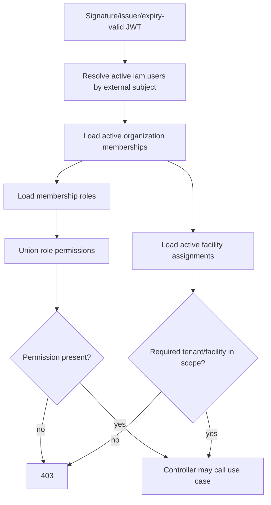

# Authorization model and complete permission matrix

Status: **[IMPLEMENTED]** from V3–V6, V8, V11, V14, V17, V20, V23, `PermissionCodes`, `CurrentAccessContextResolver` and `AccessAuthorizationService`.

Three facts must remain distinct:

1. **Role ≠ permission.** A role only contributes permissions explicitly mapped in migrations.
2. **Permission ≠ tenant scope.** Possessing `patient.read` in organization A does not authorize organization B.
3. **Valid JWT ≠ authorized resource access.** The subject must resolve to an active IAM user, active membership, appropriate permission and—where required—active facility assignment.

## Stable roles

| Role | Stable UUID | Scope | Automatic clinical access? |
|---|---|---|---|
| SYSTEM_ADMIN | `00000000-0000-0000-0000-000000000001` | SYSTEM | no permissions seeded; no automatic clinical access |
| ORGANIZATION_ADMIN | `00000000-0000-0000-0000-000000000002` | ORGANIZATION | only permissions explicitly listed below |
| CLINIC_MANAGER | `00000000-0000-0000-0000-000000000003` | ORGANIZATION | operational management; encounter read only |
| DOCTOR | `00000000-0000-0000-0000-000000000004` | ORGANIZATION | encounter/note permissions listed below |
| NURSE | `00000000-0000-0000-0000-000000000005` | ORGANIZATION | encounter and clinical-note read only |
| RECEPTIONIST | `00000000-0000-0000-0000-000000000006` | ORGANIZATION | no encounter/clinical-note permission |
| PHARMACIST | `00000000-0000-0000-0000-000000000007` | ORGANIZATION | catalog/schedule/practitioner read only currently |
| LAB_TECHNICIAN | `00000000-0000-0000-0000-000000000008` | ORGANIZATION | catalog/schedule/practitioner read only currently |

## Complete permission-to-role matrix

Every current `PermissionCodes` value appears once. “None” means no role mapping in V1–V24.

| Module | Permission | Roles granted by committed migrations |
|---|---|---|
| Organization | `organization.read` | ORGANIZATION_ADMIN, DOCTOR |
| Organization | `organization.manage` | ORGANIZATION_ADMIN |
| Facility | `facility.read` | ORGANIZATION_ADMIN, DOCTOR |
| Facility | `facility.manage` | ORGANIZATION_ADMIN |
| IAM | `iam.user.read` | ORGANIZATION_ADMIN |
| IAM | `iam.user.manage` | ORGANIZATION_ADMIN |
| IAM | `iam.role.manage` | ORGANIZATION_ADMIN |
| Patient | `patient.read` | ORGANIZATION_ADMIN, DOCTOR, NURSE, RECEPTIONIST |
| Patient | `patient.create` | ORGANIZATION_ADMIN, RECEPTIONIST |
| Patient | `patient.update` | ORGANIZATION_ADMIN, DOCTOR, NURSE |
| Practitioner | `practitioner.read` | ORGANIZATION_ADMIN, CLINIC_MANAGER, DOCTOR, NURSE, RECEPTIONIST, PHARMACIST, LAB_TECHNICIAN |
| Practitioner | `practitioner.create` | ORGANIZATION_ADMIN, CLINIC_MANAGER |
| Practitioner | `practitioner.update` | ORGANIZATION_ADMIN, CLINIC_MANAGER |
| Service catalog | `service.read` | ORGANIZATION_ADMIN, CLINIC_MANAGER, DOCTOR, NURSE, RECEPTIONIST, PHARMACIST, LAB_TECHNICIAN |
| Service catalog | `service.create` | ORGANIZATION_ADMIN, CLINIC_MANAGER |
| Service catalog | `service.update` | ORGANIZATION_ADMIN, CLINIC_MANAGER |
| Scheduling | `schedule.read` | ORGANIZATION_ADMIN, CLINIC_MANAGER, DOCTOR, NURSE, RECEPTIONIST, PHARMACIST, LAB_TECHNICIAN |
| Scheduling | `schedule.create` | ORGANIZATION_ADMIN, CLINIC_MANAGER |
| Scheduling | `schedule.update` | ORGANIZATION_ADMIN, CLINIC_MANAGER |
| Appointment | `appointment.read` | ORGANIZATION_ADMIN, CLINIC_MANAGER, RECEPTIONIST, DOCTOR, NURSE |
| Appointment | `appointment.create` | ORGANIZATION_ADMIN, CLINIC_MANAGER, RECEPTIONIST |
| Appointment | `appointment.update` | ORGANIZATION_ADMIN, CLINIC_MANAGER, RECEPTIONIST |
| Reception | `queue.read` | ORGANIZATION_ADMIN, CLINIC_MANAGER, RECEPTIONIST, DOCTOR, NURSE |
| Reception | `queue.create` | ORGANIZATION_ADMIN, CLINIC_MANAGER, RECEPTIONIST |
| Reception | `queue.update` | ORGANIZATION_ADMIN, CLINIC_MANAGER, RECEPTIONIST, DOCTOR, NURSE |
| Encounter | `encounter.read` | ORGANIZATION_ADMIN, CLINIC_MANAGER, DOCTOR, NURSE |
| Encounter | `encounter.create` | DOCTOR |
| Encounter | `encounter.update` | DOCTOR |
| Clinical note | `clinical_note.read` | DOCTOR, NURSE |
| Clinical note | `clinical_note.update` | DOCTOR |

SYSTEM_ADMIN has **none** of the thirty permissions through committed mappings. PHARMACIST and LAB_TECHNICIAN have only the three read permissions explicitly shown. Do not infer additional access from names.

## Exact encounter matrix

| Role | encounter.read | encounter.create | encounter.update | clinical_note.read | clinical_note.update |
|---|---:|---:|---:|---:|---:|
| ORGANIZATION_ADMIN | yes | no | no | no | no |
| CLINIC_MANAGER | yes | no | no | no | no |
| DOCTOR | yes | yes | yes | yes | yes |
| NURSE | yes | no | no | yes | no |
| RECEPTIONIST | no | no | no | no | no |
| PHARMACIST | no | no | no | no | no |
| LAB_TECHNICIAN | no | no | no | no | no |
| SYSTEM_ADMIN | no | no | no | no | no |

## Resolution and scope algorithm

`requireOrganizationPermission` requires an organization access record containing the permission. `requireFacilityPermission` finds an organization access whose `facilityIds` contains the facility and then checks permission. `requireMembershipPermission` first resolves the active target membership and delegates to its organization. `requireUserPermission` finds active organizations shared with the target user and requires the permission in at least one.

## Endpoint ownership and scoping cautions

- Organization and IAM controllers use organization, membership, user or facility-specific authorization helpers as described in the [API contract](04-API-SPEC.md).
- Patient, practitioner, catalog, scheduling, appointment, queue and encounter controllers generally require **organization** permission and rely on use-case/repository IDs for organization/facility filtering. They do not consistently call `requireFacilityPermission` merely because a path contains `facilityId`.
- Mobile may hide actions based on `/auth/me`, but the backend is the enforcement boundary.
- There is no database row-level security. Tenant isolation depends on application authorization, scoped repository queries and composite database constraints.
- `POST /api/v1/organizations` bypasses JWT and permission checks. This is **P0 SECURITY DEBT BEFORE PRODUCTION**.

## Verification obligations

Contract tests must cover each endpoint's 401, a role lacking permission (403), a caller with the permission in another organization (403/404 according to the current operation), inactive membership, inactive facility assignment where applicable, and successful least-privilege access. Add explicit regression tests before changing role grants; migration changes are security changes.

## Related documents

- [API contract](04-API-SPEC.md)
- [Security and threat model](06-SECURITY.md)
- [Database IAM tables](05-DATABASE.md)
- [Mobile authentication](mobile/MOBILE-AUTH.md)
- [Traceability](13-TRACEABILITY.md)
