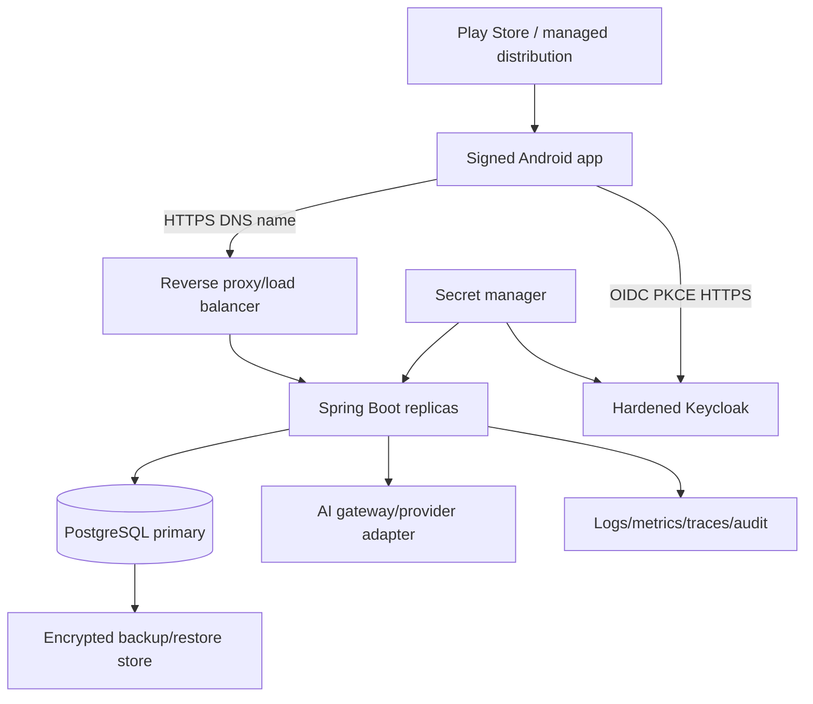

# Deployment architecture and release operations

## Current local development — [IMPLEMENTED]

`infrastructure/docker-compose.dev.yml` runs PostgreSQL 17 for VieHeal, PostgreSQL 17 for Keycloak and Keycloak 26.7.4 with `start-dev`. Backend has a Dockerfile and defaults to the `dev` Spring profile. Host ports are 5433 (application DB), 8081 (Keycloak) and 8080 (backend when run locally). Passwords are required through environment variables. This is not staging or production.

## Target staging — [TARGET PRODUCTION DESIGN]

Staging uses production-like container/image, PostgreSQL version/extensions, Keycloak realm/client, TLS/DNS, Flyway path, observability and Android staging build. Data is synthetic/de-identified. Access is restricted; provider/model configuration mirrors production policy without using production secrets. Every release candidate runs OIDC, API/PostgreSQL, Android E2E, migration, AI and rollback smoke tests here.

## Target production — [TARGET PRODUCTION DESIGN]

No cloud provider is selected. Requirements are provider-neutral: managed DNS/certificates, private service/database networks where possible, least-privilege identities, encrypted durable storage, multi-zone choices according to approved RPO/RTO and infrastructure as code.

## Configuration inventory

| Component | Non-secret configuration | Secret material |
|---|---|---|
| Android | API base URL, OIDC issuer, public client ID, redirect URI, feature flags | signing key access; no runtime backend/AI secret |
| Backend | profile, port, issuer/audience, DB host/name, AI provider/model/prompt version, telemetry endpoints | DB password, AI provider credential, telemetry credential |
| PostgreSQL | instance/database, extensions, pool/backup policy | admin/migration/runtime credentials |
| Keycloak | hostname, realm, public mobile client, backend audience, token/MFA policy | admin/bootstrap and DB credentials |
| Gateway | DNS routes, limits, health paths, TLS policy | certificate private key if not managed |

Secrets enter at runtime from a secret manager, never repository, image layer, BuildConfig or log. Production profiles must fail closed when required configuration is absent.

## CI/CD and migration sequence

1. Build immutable backend image and Android artifact from a commit; generate SBOM; scan dependencies/container/secrets.
2. Run unit and Testcontainers integration tests; validate Flyway checksum/empty schema/upgrade path.
3. Deploy compatible change to staging; execute OIDC/API/E2E/AI/security/performance smoke.
4. Approve with evidence manifest; verify current backup and migration lock/readiness.
5. For low downtime, use expand→deploy compatible code→backfill/verify→contract in a later release. Avoid long table rewrites/locks; rehearse representative data volume.
6. Run Flyway once using controlled migration identity; application runtime uses narrower credentials.
7. Roll backend gradually, observe readiness/error/latency; then stage Android distribution.
8. Record version, image digest, Flyway version, realm/config and prompt/model version.

## Health and rollback

Liveness answers whether the process should restart. Readiness verifies required ability to serve without leaking details: DB connectivity/migration compatibility and critical configuration; Keycloak/AI availability may be degraded rather than make every clinical endpoint unavailable, according to policy. `/api/v1/health` currently reports static service UP and is not sufficient production readiness.

Application rollback is safe only while schema is backward-compatible. Do not roll back an irreversible schema by editing V1–V24; deploy a forward repair or invoke an incident-approved restore. Android clients remain installed after server rollback, so APIs maintain compatibility and risky features use server flags. AI kill switch leaves manual notes available.

## Backup, DNS and certificates

Define encrypted full/incremental/PITR policy, separate access, immutable retention and scheduled restore drills. RPO/RTO, retention and region are **[REQUIRES POLICY DECISION]**. DNS TTL, certificate issue/renewal/expiry alert and emergency rotation have named operational owners. Keycloak and its DB need backup/recovery consistent with session/account requirements.

## Related documents

[Architecture](02-ARCHITECTURE.md), [Database](05-DATABASE.md), [Security](06-SECURITY.md), [Observability](11-OBSERVABILITY.md), [Mobile release](mobile/MOBILE-RELEASE.md).
