# AI production architecture

Status: **[TARGET PRODUCTION DESIGN] / [EVIDENCE GAP]**. `ai-platform/` contains no implementation; no provider/model/key/endpoint is verified.

```mermaid
flowchart LR
  M[Android clinician] -->|JWT + encounter ID + task| API[VieHeal API]
  API --> AUTH[Permission + tenant + encounter authorization]
  AUTH --> CTX[Server context builder/minimizer]
  CTX --> PR[Versioned prompt registry]
  PR --> GW[AI gateway/orchestrator]
  GW --> PA[Provider adapter]
  PA --> MODEL[Configured model]
  MODEL --> VAL[JSON schema + grounding validation]
  VAL --> SAFE[Safety policy]
  SAFE --> DRAFT[Reviewable draft]
  DRAFT --> HUMAN[Clinician edit/reject/apply]
  HUMAN -->|explicit normal application write| NOTE[ClinicalNote API]
```

The mobile request supplies the task and current encounter identifier, not arbitrary patient context. Backend first applies encounter/clinical-note permission and organization/facility scope. Context builder loads the current encounter/note from repositories, selects only fields allowed by the task and adds source labels. Authorization failure returns before any provider invocation.

## Component contracts

| Component | Input | Responsibility | Output/failure |
|---|---|---|---|
| AI API controller | JWT, scoped path, task request | validate size/task; authorize; correlation | accepted draft response or typed 400/401/403/404/409/503 |
| context builder | authorized encounter identity | fetch/minimize, delimit untrusted text, provenance | `AuthorizedContext`; never accepts foreign raw context |
| prompt registry | task, prompt version, locale | immutable versioned system/task/schema template | rendered request plus versions |
| gateway | context/config | budget, timeout, provider call, telemetry, circuit breaker | provider-neutral candidate |
| provider adapter | model request + server credential | translate provider protocol; never expose key | raw response or timeout/rate/provider error |
| output validator | raw response/schema/context | parse strict JSON; length/keys/grounding | validated candidate or rejection |
| safety policy | candidate + intended use | block autonomous diagnosis/prescription/facts/cross-scope behavior | safe draft/warnings/refusal |
| review workflow | safe draft | return marked draft; accept edit/reject decision | no automatic persistence |

## Target API and persistence boundary

A candidate endpoint is `POST /api/v1/organizations/{organizationId}/facilities/{facilityId}/encounters/{encounterId}/ai/documentation-drafts`; exact naming/status is **[REQUIRES POLICY DECISION]** and must not be treated as current. Request includes task, optional requested sections, locale and client request ID; it never includes provider/model/key. Response includes draft sections, missing information, warnings, grounding references, prompt/schema versions and draft ID.

Persist only metadata necessary for safety/audit: actor, scope, encounter, task, prompt/schema/provider/model version, timestamps, latency/token counts, validation outcome and clinician accept/edit/reject. Whether encrypted draft text is retained is **[REQUIRES POLICY DECISION]** and **[REQUIRES LEGAL REVIEW]**; routine logs never contain prompt/response bodies.

## Reliability and operations

Timeout/cancellation, quota/rate-limit mapping, bounded circuit breaker, provider health dashboard, cost/token budget, server-side kill switch and model/prompt rollback are required. Provider failure preserves manual note editing. Do not synthesize a fallback clinical draft or retry writes. A provider adapter supports replacement without changing mobile contract.

## Related documents

[Primary use case](AI-USE-CASES.md), [Prompt design](AI-PROMPT-DESIGN.md), [Safety](AI-SAFETY.md), [Evaluation](AI-EVALUATION.md), [Security threat model](../06-SECURITY.md), [API contract](../04-API-SPEC.md).
