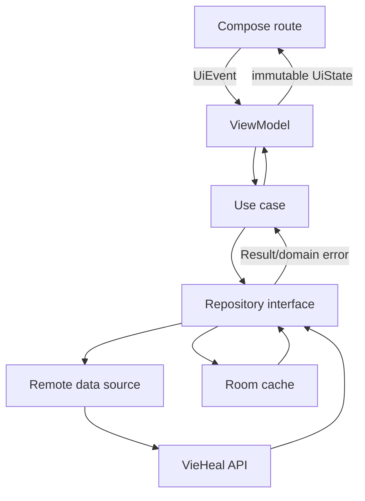

# Mobile architecture

**[TARGET PRODUCTION DESIGN] [EVIDENCE GAP]** Kotlin, Jetpack Compose, single Activity, Navigation Compose, ViewModel, immutable `StateFlow`, coroutines, dependency injection, repository ports, Retrofit/OkHttp, Room, DataStore and WorkManager. Verify current stable library versions when implementation starts; no version is claimed here.

Compose routes render state and emit events; they do not call Retrofit/DAO. ViewModels coordinate screen work and survive configuration changes. `SavedStateHandle` stores identifiers, filters and small drafts needed for process recreation—not tokens or full patient objects. Use cases contain reusable orchestration. Repositories own source selection, cache and DTO/domain mapping.

Single source of truth is feature-specific: backend for clinical/business truth; Room may drive observable read screens while repositories refresh remotely. Writes go to the backend first unless an explicitly designed offline command is safe. Dependency injection provides production and test implementations without service locators.

Errors are sealed domain outcomes: connectivity, timeout, validation, unauthenticated, forbidden, not found, conflict, server, parsing and unknown. Cancellation is never converted to failure. State transitions are reducer-like and deterministic, making ViewModel tests table-driven.
