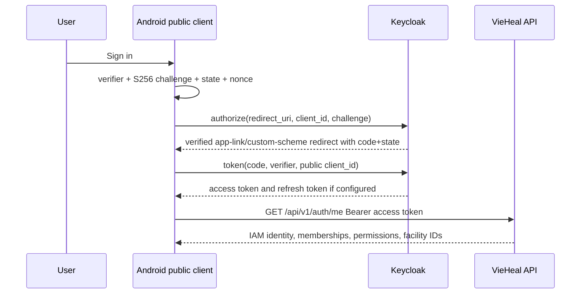

# Mobile authentication and session design

Status: backend Keycloak JWT validation is **[IMPLEMENTED]**; Android OIDC is **[TARGET PRODUCTION DESIGN]**.

## Authorization Code + PKCE sequence

Authorization/token/end-session endpoint URLs come from OIDC discovery under the environment issuer; do not hard-code realm endpoint fragments. Redirect URI is uniquely registered, exact and claimed by the app; prefer verified HTTPS App Link when operationally available, otherwise a private scheme with collision risk documented. Validate state, nonce, issuer and returned redirect.

The Android registration is a **public client** with PKCE S256 and no confidential client secret. No admin/doctor password is shipped. Access token is attached only to VieHeal origin. Refresh support/lifetime/rotation follow realm policy; one mutex-protected refresh prevents storms. Backend should validate audience in addition to current issuer/signature/expiry as a target hardening item.

## Storage boundaries

Keep access tokens in memory when practical. Persist refresh/session state only through the chosen OIDC library and Android Keystore-backed protected mechanism. Keystore protects cryptographic keys, not arbitrary large objects; ciphertext metadata may live in private storage. DataStore is not token storage. Biometric gating is a policy decision and cannot replace server expiry/revocation.

## Session events

| Event | Required behavior |
|---|---|
| cold start | load protected auth state; validate expiry/refresh; call `/auth/me`; select active authorized scope |
| 401 | one refresh/replay; if unsuccessful, mark SessionExpired, cancel protected work, erase token/cache and clear back stack |
| 403 | keep session; render permission denied; refresh context only on explicit/stale permission policy |
| background→foreground | refresh only when token nearing expiry; avoid simultaneous screen calls |
| logout | attempt token revocation/end-session; always erase local session/protected scope and navigate login even if network fails |
| user/scope switch | cancel old requests and clear old cache before new scope is active |
| account disabled/revoked | `/auth/me` failure leads to locked-out state and cleanup |

Do not persist full clinical drafts merely to survive login. If session expires while editing, apply the approved protected-draft policy and never reveal the draft on another user session.

## Verification

Test success, browser cancel, malicious/mismatched state, wrong redirect, missing code, network/token failure, refresh concurrency, revoked refresh, wrong issuer/audience, logout offline, process death during browser return and multi-user residue. Inspect release APK for secret/client credential.

## Related documents

[Backend authorization](../07-AUTHORIZATION.md), [Security](../06-SECURITY.md), [Networking](MOBILE-NETWORKING.md), [Navigation](MOBILE-NAVIGATION.md).
