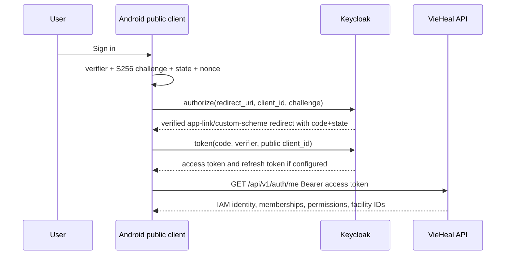

# Mobile authentication and session design

Status: **[IMPLEMENTED]** in Phase 2 for Android OIDC discovery, Authorization Code + PKCE S256, protected token persistence, refresh serialization, `/auth/me` gating, startup restoration, and local logout. A live emulator-to-Keycloak browser exercise is still required in each deployed environment.

## Authorization Code + PKCE sequence


```mermaid
sequenceDiagram
  participant U as User
  participant M as Android public client
  participant K as Keycloak
  participant B as VieHeal API
  U->>M: Sign in
  M->>M: verifier + S256 challenge + state + nonce
  M->>K: authorize(redirect_uri, client_id, challenge)
  K-->>M: verified app-link/custom-scheme redirect with code+state
  M->>K: token(code, verifier, public client_id)
  K-->>M: access token and refresh token if configured
  M->>B: GET /api/v1/auth/me Bearer access token
  B-->>M: IAM identity, memberships, permissions, facility IDs
```

Authorization/token/end-session endpoint URLs come from OIDC discovery under the environment issuer; do not hard-code realm endpoint fragments. Redirect URI is uniquely registered, exact and claimed by the app; prefer verified HTTPS App Link when operationally available, otherwise a private scheme with collision risk documented. Validate state, nonce, issuer and returned redirect.

The Android registration is a **public client** with PKCE S256 and no confidential client secret. AppAuth uses the system browser/Custom Tabs; no WebView captures credentials. AppAuth correlates the authorization response with its serialized request state and the request includes a random nonce. No admin/doctor password is shipped. Access token is attached only to the configured VieHeal `/api/v1/auth/me` endpoint. Refresh support/lifetime/rotation follow realm policy; one mutex-protected refresh prevents storms. Backend audience validation remains a documented hardening item because the current resource-server configuration validates issuer, signature and expiry.

## Configuration and local development

Supply non-secret values outside version control, for example in the developer's Gradle user properties:

```properties
VIEHEAL_OIDC_ISSUER=http://10.0.2.2:8081/realms/clinic-platform
VIEHEAL_OIDC_CLIENT_ID=vieheal-android
VIEHEAL_OIDC_REDIRECT_URI=com.vieheal.mobile://oauth2redirect/callback
VIEHEAL_OIDC_REDIRECT_SCHEME=com.vieheal.mobile
VIEHEAL_BACKEND_BASE_URL=http://10.0.2.2:8080
```

The debug manifest alone permits local cleartext emulator traffic. Production configuration requires HTTPS for both issuer and backend; missing/invalid settings become an explicit configuration state and never select a demo login. The development realm import registers only `com.vieheal.mobile://oauth2redirect/callback` and `com.vieheal.mobile://logout/callback`; the merged manifest constrains the exported receiver to those hosts and paths.

## Application authorization gate

Successful token exchange stores the protected token set, then calls `GET /api/v1/auth/me`. Only a 200 response mapped into `UserSessionContext` selects the authenticated graph. A 401 deletes unusable credentials; a 403 preserves credentials and displays access denied; network and 5xx responses preserve credentials and expose retryable, distinct states. Android permission data is presentational only and never replaces backend enforcement.

## Storage boundaries

Keep access tokens in memory when practical. Persist refresh/session state only through the chosen OIDC library and Android Keystore-backed protected mechanism. Keystore protects cryptographic keys, not arbitrary large objects; ciphertext metadata may live in private storage. DataStore is not token storage. Biometric gating is a policy decision and cannot replace server expiry/revocation.

## Session events

| Event | Required behavior |
|---|---|
| cold start | load protected auth state; validate expiry/refresh; call `/auth/me`; select active authorized scope |
| 401 from `/auth/me` | erase invalid credentials and select unauthenticated graph |
| 403 | keep session; render permission denied; refresh context only on explicit/stale permission policy |
| background→foreground | refresh only when token nearing expiry; avoid simultaneous screen calls |
| logout | erase local tokens/context first, select unauthenticated graph, then optionally launch provider end-session; remote failure cannot retain local authentication |
| user/scope switch | cancel old requests and clear old cache before new scope is active |
| account disabled/revoked | `/auth/me` failure leads to locked-out state and cleanup |

Do not persist full clinical drafts merely to survive login. If session expires while editing, apply the approved protected-draft policy and never reveal the draft on another user session.

## Verification

Test success, browser cancel, malicious/mismatched state, wrong redirect, missing code, network/token failure, refresh concurrency, revoked refresh, wrong issuer/audience, logout offline, process death during browser return and multi-user residue. Inspect release APK for secret/client credential.

## Related documents

[Backend authorization](../07-AUTHORIZATION.md), [Security](../06-SECURITY.md), [Networking](MOBILE-NETWORKING.md), [Navigation](MOBILE-NAVIGATION.md).
