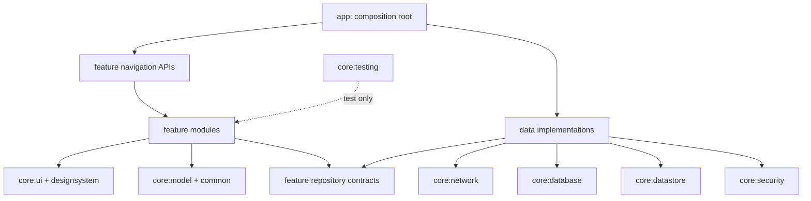

# Android module and package design

Status: **[TARGET PRODUCTION DESIGN]**. No Android source exists.

## Exact target modules

| Module | Owns | May depend on |
|---|---|---|
| `app` | Application, Activity, root navigation, DI assembly, build variant wiring | all feature navigation APIs; core modules; data bindings |
| `core:common` | result/error primitives, coroutine dispatchers, clock/ID abstractions | Kotlin/Android primitives only |
| `core:model` | shared domain identifiers and cross-feature read models | `core:common` |
| `core:network` | Retrofit services, DTOs, serializer, OkHttp/interceptors/error parser | common; model only for mapping boundary if necessary |
| `core:database` | Room database, entities, DAOs, migrations, transactions | common |
| `core:datastore` | non-secret preferences and active-scope preference | common, model |
| `core:security` | OIDC session abstraction, Keystore-backed token boundary, secure cleanup | common, model; no feature dependency |
| `core:designsystem` | tokens, theme and reusable visual components | Compose/Android only |
| `core:ui` | shared state panels, formatting and permission/offline UI | common, model, designsystem |
| `core:testing` | fakes/builders/dispatchers/test rules; test source only | core contracts; never production runtime |
| each `feature:*` | navigation contract, screen, presentation state/events, feature use cases and repository interface | common, model, ui/designsystem; feature navigation APIs only |
| `data` (initial shared implementation module) | repository implementations and DTO/entity/domain mappers | repository contracts, network, database, datastore, security |

Feature modules: `auth`, `dashboard`, `patients`, `appointments`, `queue`, `encounter`, `clinicalnote`, `assistant`, `profile`. Future: `diagnosis`, `observation`, `prescription`, `lab`, `billing`.



Dependency rules: arrows are one-way; `core:*` never imports a feature; a feature cannot import another feature's internal UI/data packages; features never instantiate Retrofit, OkHttp, Room or DataStore; DTOs remain in network, entities in database and neither appears in `UiState`; DI implementation bindings live in `app`/`data`; circular dependencies fail an architecture test. If build performance requires fewer physical modules initially, preserve these package/API boundaries and record the temporary consolidation.

## Representative package layout

```text
feature/appointments/
  navigation/AppointmentDestination.kt, AppointmentNavigation.kt
  ui/AppointmentListScreen.kt, AppointmentDetailScreen.kt, CreateAppointmentScreen.kt
  presentation/list/AppointmentListViewModel.kt, AppointmentListUiState.kt, AppointmentListEvent.kt
  presentation/detail/...
  domain/GetAppointmentsUseCase.kt, CreateAppointmentUseCase.kt, AppointmentRepository.kt

data/appointments/
  AppointmentRepositoryImpl.kt
  remote/AppointmentRemoteDataSource.kt, AppointmentDtoMapper.kt
  local/AppointmentLocalDataSource.kt, AppointmentEntityMapper.kt

core/network/appointment/AppointmentService.kt, AppointmentDto.kt
core/database/appointment/AppointmentEntity.kt, AppointmentDao.kt
```

Placement is consistent across features: `Screen` in `ui`; immutable state/events/ViewModel in `presentation/<route>`; feature orchestration and repository **interface** in `domain`; repository implementation in `data/<feature>`; Retrofit service/DTO in `core:network`; Room entity/DAO in `core:database`; DTO and entity mappers beside their respective data sources. A navigation API exposes route builders and callbacks, not ViewModels.

## Build enforcement

Add module dependency tests/static rules, API visibility (`internal` by default), test-fixture separation and release dependency reports. `core:testing` and any MockWebServer/fake provider must be absent from release runtime classpaths.

## Related documents

[Mobile architecture](MOBILE-ARCHITECTURE.md), [State management](MOBILE-STATE-MANAGEMENT.md), [Data](MOBILE-DATA.md), [ADR-004](../adr/ADR-004-mobile-architecture.md).
