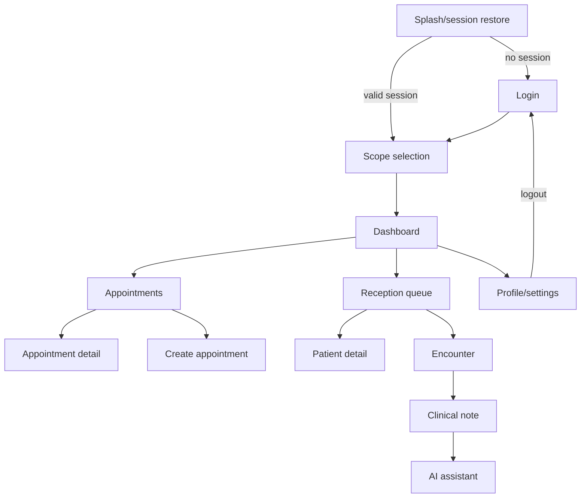

# Mobile navigation

## Target graph

Routes carry stable IDs only. Repositories reload authoritative data. Protected destinations require a valid session and active organization/facility. Role-aware visibility is a convenience; backend permission checks remain authoritative. A 401 atomically marks session expired, clears protected back stack and routes to login. A 403 stays in session and shows permission denied with a safe destination. A deleted resource (404) pops to its list with notice; 409 keeps the editor and offers refresh/reconcile.

Back from an unsaved clinical draft requests confirmation. Successful creation uses `popUpTo` to avoid duplicate forms. Logout clears all protected destinations. Process recreation rebuilds from typed route IDs and `SavedStateHandle`. Deep links are disabled initially or restricted to verified HTTPS/app links, authenticated resolution and allowlisted routes; never include patient names or clinical text.
