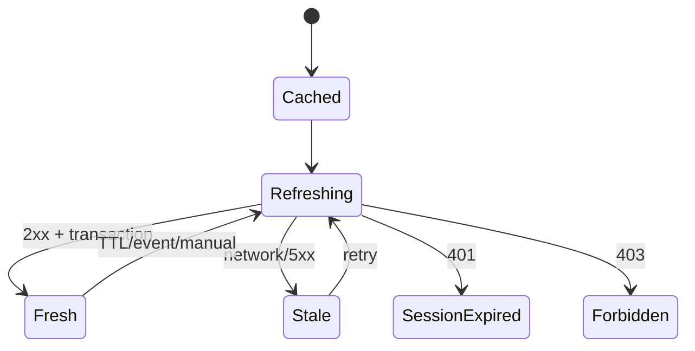

# Offline and synchronization

Offline read support is **[TARGET PRODUCTION DESIGN]**. Display minimized cached appointments, queue and active encounter summaries with a clear “last updated” time. Authentication and permission changes cannot be reliably validated offline, so sensitive actions remain unavailable unless a formal offline authorization policy is approved.

Do not queue encounter completion, appointment transitions, queue advancement or note writes by default: they are stateful and conflict-prone. WorkManager may refresh idempotent reads with constraints and bounded backoff. If note-draft offline editing is required, maintain a local unsent draft separately, display status, and require explicit reconciliation against a server version before save.

Invalidation triggers: TTL, pull-to-refresh, successful mutation, push/event signal if later added, scope change, 401/403, and related workflow transition. Stale content is never presented as fresh. Sync metadata includes scope, last attempt/success, server version/ETag and error class. Test airplane mode, app kill, clock drift, long offline periods, permission revocation and conflict after reconnect.
