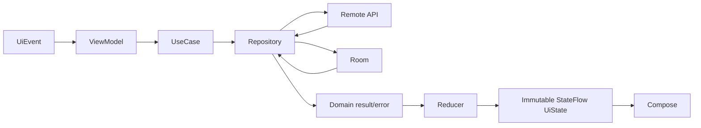

# Mobile state, lifecycle and restoration contract

Status: **[TARGET PRODUCTION DESIGN]**.

## Data flow



Compose is a pure renderer plus event source. ViewModel serializes writes, cancels obsolete reads, preserves cancellation and reduces every result. Repository chooses remote/local and maps transport/database models. One-off navigation/snackbar effects use a bounded effect stream or callback; durable facts remain in state.

## Representative models

```kotlin
data class AppointmentListUiState(
    val phase: LoadPhase = LoadPhase.Initial,
    val items: List<AppointmentItem> = emptyList(),
    val filter: AppointmentFilter = AppointmentFilter(),
    val isRefreshing: Boolean = false,
    val freshness: Freshness = Freshness.Unknown,
    val blockingError: AppError? = null,
    val refreshError: AppError? = null,
    val access: AccessState = AccessState.Allowed
)

sealed interface AppointmentListEvent {
    data object Load : AppointmentListEvent
    data object Refresh : AppointmentListEvent
    data class ChangeFilter(val filter: AppointmentFilter) : AppointmentListEvent
    data class Open(val appointmentId: UUID) : AppointmentListEvent
    data object Retry : AppointmentListEvent
}

sealed interface LoadPhase {
    data object Initial : LoadPhase
    data object Loading : LoadPhase
    data object Content : LoadPhase
    data object Empty : LoadPhase
    data object Error : LoadPhase
}
```

`phase` is mutually exclusive, so Loading/Error/Success cannot all be true. Refreshing is orthogonal because content remains visible. `AccessState` represents Allowed, Unauthorized, Forbidden and ScopeMissing. Validation errors belong to the relevant form state; conflicts contain current server state and retained draft. Offline is freshness/connectivity metadata, not proof that a request will fail.

## Required transitions

| Input/result | State transition | UI obligation |
|---|---|---|
| first load | Initial→Loading→Content/Empty/Error | skeleton; no duplicate request |
| cached then refresh | Content/Empty with stale freshness + isRefreshing | retain content and timestamp |
| network unavailable | cached content→Offline/Stale or blocking Error | safe retry; disable unsafe write |
| 400 | form retains input + field/general ValidationError | focus/announce first error |
| 401 after one refresh attempt | access=Unauthorized | clear protected navigation/session according to auth contract |
| 403 | access=Forbidden | show safe permission state, no relogin loop |
| 404 | invalidate item | return/list refresh with notice |
| 409 | keep draft + Conflict(currentState/code) | reload/explicit reconcile; never discard silently |
| write success | update/invalidate cache and Content | announce confirmation only after server response |

## Lifecycle ownership

- **Configuration change:** route-scoped ViewModel and StateFlow survive; Compose uses lifecycle-aware collection.
- **Process death:** `SavedStateHandle` persists route IDs, filters, tab, scroll anchor and non-sensitive form identifiers. It does not store tokens, patient objects or full clinical notes.
- **Clinical draft:** default is memory only. If product policy requires recovery, store an encrypted/scoped temporary draft with expiry and explicit risk approval; delete on successful save/logout/scope switch.
- **Navigation arguments:** stable UUID strings and optional non-sensitive filter only; reload authoritative object.
- **Cold start:** restore OIDC session, validate `/auth/me`, restore or request active scope, then enter protected graph.
- **Background/foreground:** re-evaluate token freshness and cache TTL; do not refresh every screen simultaneously.
- **Session expiry:** serialize refresh; on failure erase credentials/protected cache and clear back stack.
- **Scope change:** cancel old-scope jobs, clear memory and protected old-scope cache, reset feature graphs, then fetch new scope.
- **Logout:** revoke/end session when supported, erase local protected data, clear tasks/back stack, navigate login even if network logout fails.

## Testing contract

Table-test every event/result transition, duplicate submit, cancellation, late response after navigation, refresh failure with retained data, rotation and process recreation. Compose tests assert semantics for each phase; repository tests assert source/freshness behavior.

## Related documents

[Mobile architecture](MOBILE-ARCHITECTURE.md), [Navigation](MOBILE-NAVIGATION.md), [Error handling](MOBILE-ERROR-HANDLING.md), [Testing](MOBILE-TESTING.md).
