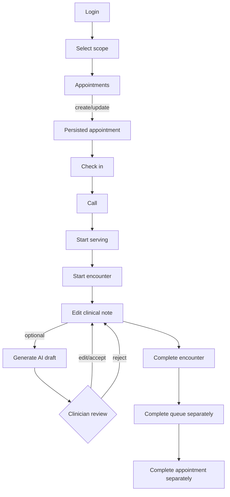

# User flows

Alternate edges: unauthenticated→login; forbidden→permission state; not found→list refresh; conflict→preserve input and reload; offline→cached read/manual retry. Final prototype must exercise these branches, not only the happy path.
